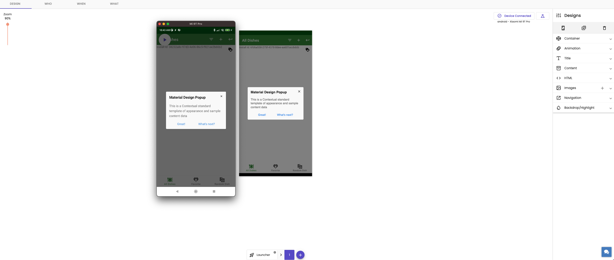
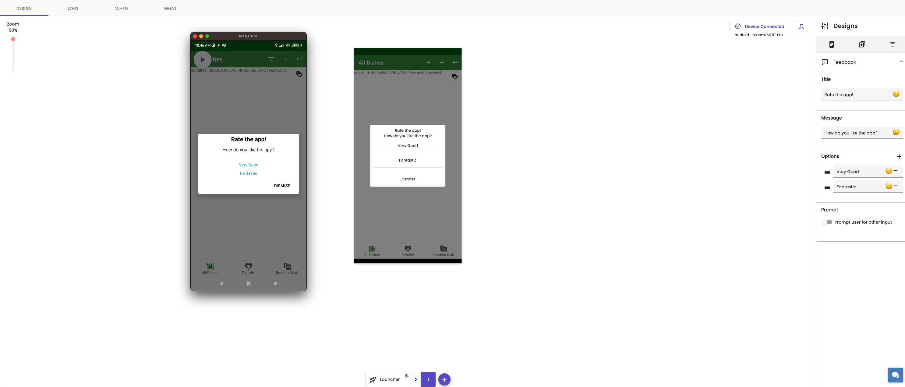
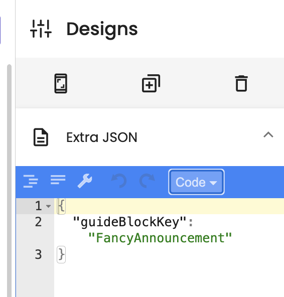
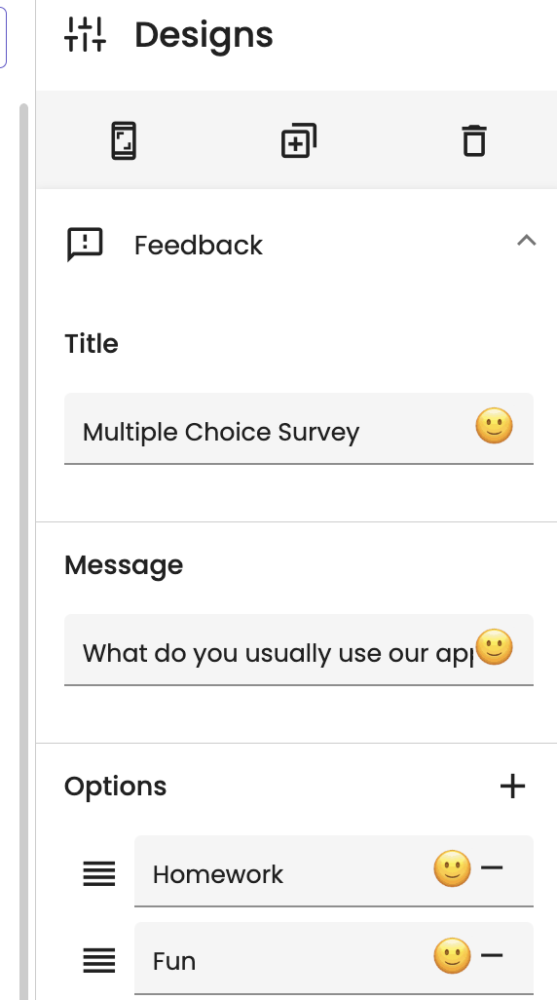

# Contextual


https://contextu.al/ 
[](https://twitter.com/contextu_al)


# FavDish
Native android sample app developed by the contextual android team, used in testing sdk features,
this is also the primary app used in testing CST conditions via BDD. 

### Build Instructions
- make sure to follow contextual integration steps on our [docs](https://dashboard.pointzi.com/docs/sdks/android/integration/)
- after a successful build upload the app to AppCenter
- verify test app meets [QA testing requirements](https://streethawk.atlassian.net/wiki/spaces/PPD/pages/1900707864/SDK+Testing+Requirements)

To run this application on your device, simply run

```
./gradlew installProdDebug
```

The `app_key` for this app is `Favdish`, it can be found in `app/build.gradle`. You may have to change the `app_key` to your
account's `app_key` for the application to work.


To run this application on your device, simply run

```
./gradlew installProdDebug
```

The `app_key` for this app is `Favdish`, it can be found in `app/build.gradle`. You may have to change the `app_key` to your
account's `app_key` for the application to work.


This sample application show's Contextual SDK for both no-code and low code use-cases.

# Using Contextual SDK for "No Code" engagement

1. Create an account at [Contextual Dashboard](https://dashboard.contextu.al/ "Contextual Dashboard").
2. Install the Contextual SDK following the instructions for IOS or Android.
3. Follow this [video]( https://player.vimeo.com/video/733886063?h=c799c48907&amp;badge=0&amp;autopause=0&amp;player_id=0&amp;app_id=58479  "Guide Creation How-to") for more step-by-step guide creation.

The following screenshots shows what our SDK can do using the dashboard and live device side by side

Example of PopupModal



Example of NPS Survey



# Extensibility - Using Contextual SDK for with "Low Code"

Do you like something that Contextual doesn’t offer in our No Code engagement? Contextual provide a powerful capability to use your favourite open source UI elements or even your own in-App elements as part of Guides. We call these "GuideBlocks".


## Fancy Announcement

In this example, we show how to make a Fancy Announcement, just like the crazy ones your Designer comes up with 🤣. Its a simple example to get you started with Contextual Extensibility without needing to hard-code your changes every time you want to update the tip.

1. Create an account at [Contextual Dashboard](https://dashboard.contextu.al/ "Contextual Dashboard").
2. Install the Contextual SDK following the instructions for IOS or Android.
3. Add the sample wrapper code  *FancyAnnouncement* to your App. 
4. Copy-Paste the instantiation of the Guide Component AFTER the Contextual SDK registration. 
5. Build your App and Run it on a phone or 
6. Go to the Dashboard and create a guide:
 * Use this [video]( https://vimeo.com/863886653#t=0m58s "Another Guide Creation How-to") to see the steps
 * choose “Display the guides on any screen of your app” and 
 * pick one of the “Standard” Contextual Announcement Templates.
 * Preview the Announcement on your Phone - it should look similar to the template
7. Now go to the Extensibility section in the sidebar and paste in the JSON as follows:
`
{
  "guideBlockKey": "FancyAnnouncement"
}
`
 * Match the name in the JSON to the name of your wrapper in the code

 

8. If you are still in Preview Mode, then you should see the Announcement will magically change to Fancy Announcement
9. Change the Title and Content and buttons. Play around with it and see the results.
10. Save the guide and show to your Product Team, once you release this version of the App they can launch Fancy Announcement to whoever they want, whenever they want.

 

## List Row Insertion

The Apps' existing code can be now orchestrated for Product Team to make use of. This powerful but simple example shows how you can add engagement for promotional content in existing app lists without cluttering screen realestate. Do engagemet just like Twitter or Facebook does and no need for Appstore releases! (after the initial low code work is done)

This example illustrates how you can extend your existing lists with engagement messaging, inline. Your App developer can add this and with a few lines of code extend your application so that a new row can be targeted to specific users with promotional or explanatory content entered from the Contextual Dashboard - no code!

This row example is based on a standard Contextual Announcement template. The steps are:
1. Create an account at [Contextual Dashboard](https://dashboard.contextu.al/ "Contextual Dashboard").
2. Install the Contextual SDK following the instructions for IOS or Android.
3. Your developer:
 *  adds your existing row content creation to this source code example.
 * Add the sample wrapper code for example, *AdhocRowInsertion*
4. In the Dashboard, create or edit a Guide.
5. Choose an Announcement Template that best shows the design of a row in your app. For example, do you have Titles, Content, Pictures.
6. Copy-Paste the instantiation of the Guide Component AFTER the Contextual SDK registration. 
 * Now go to the Extensibility section in the sidebar and paste in the JSON as follows:

 `
 {
  "guideBlockKey": "AdhocRowInsertion",
  "position": 1,
  "cellID": "customCellID",
  "rowHeight": 300,
  "name": "Feature"
}
`

7. In the sidebar under the relevent sections: Edit the title, content, image location (upload images etc)
8. Save the guide and show to your Product Team, once you release this version of the App they can launch List Row Insertion to whoever they want, whenever they want.

 

 ## Multiple Choice Survey 

This is a terrific example about how complex or very custom use-cases can be deployed and easily used by your Product Team. Its the best of Code and No-code combined! Extend your Apps capabilities once, THEN

* launch once, twice, many times 
* to specific users and
* measure results.

1. Create an account at [Contextual Dashboard](https://dashboard.contextu.al/ "Contextual Dashboard").
2. Repeat the steps 1-5 above. In the code for the wrapper make it's name *MultipleChoiceCustom*

`
{
  "guideBlockKey": "MultipleChoiceCustom"
}
`


3.  In the sidebar under the relevent sections:
 * Edit the title, content
 * Change the Question and the Answer options
4. Save the guide and show to your Product Team, once you release this version of the App they can launch Multiple Choice Survey to whoever they want, whenever they want.



## Multiple Choice Survey as a List Row Insertion
Another example is a combination of the survey and a List Row insertion. Try it out, it should/could look like this:


